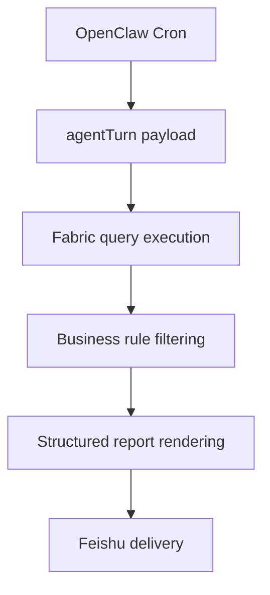

# Architecture

## Core runtime flow

## Layers

### 1. Scheduler layer
OpenClaw cron triggers the job on a fixed schedule with an explicit time zone.

### 2. Execution layer
The job runs as an `agentTurn`, allowing natural-language instructions to define the workflow.

### 3. Data layer
The agent queries a structured source such as Microsoft Fabric.

### 4. Business-rule layer
The prompt contains scope, exclusions, ranking logic, and output constraints.

### 5. Delivery layer
The final rendered result is pushed to a target chat channel.

## Why this pattern is useful

This design avoids building a full custom service while still supporting:
- recurring automation
- real data access
- business-rule enforcement
- stakeholder-facing formatted outputs
- lightweight operational deployment
